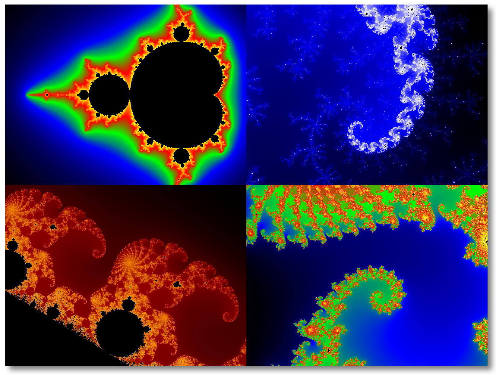
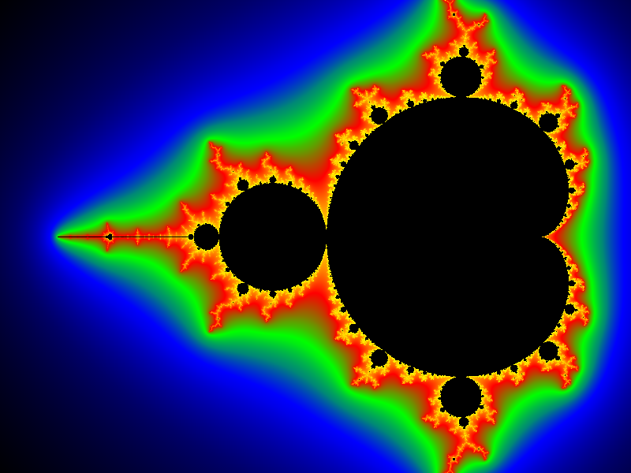
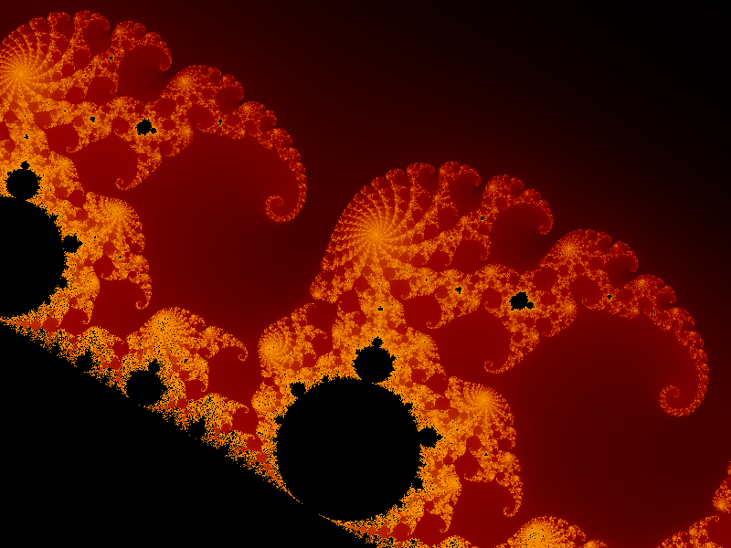
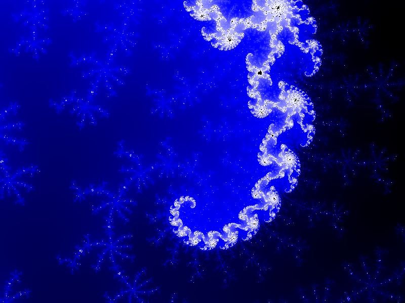
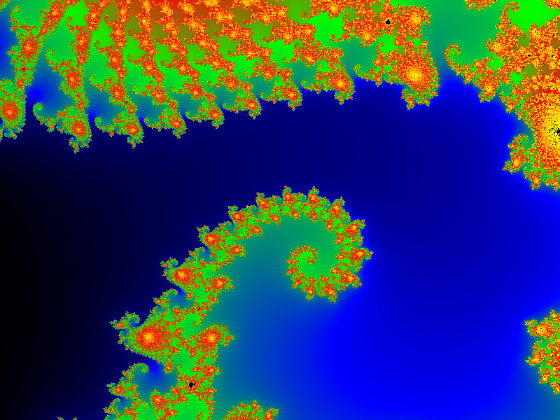

# Mandelbrot Comparison
A comparison of Mandelbrot Set programs in different languages with histogram based smooth coloring and a built-in benchmark mode.

## Status

| Language | Status |
| -------- | ------ |
| C        | Done.  |
| C++      | Done.  |
| Python   | Done.  |
| Swift    | Done.  |
| PHP      | Maybe? |

## Some background

I made these programs while learning Swift: I needed a not too simple yet on the other hand not too complex example program to translate into Swift. And I wanted something for performance measurements, to compare Swift with C. That's how this multi-language comparison started.

## Some thoughts what these programs are about

I want to compare the shape, size and performance of a simple yet computationally intensive program between different languages. The programs should be real life examples without too much fancy stuff.

1. The whole code in one file.
2. No dependencies. Just the base language and standard library.
3. Simple code, nothing fancy. That means no assembly optimizations or calling C functions from within Python that do all the work.
4. Error handling is pretty poor. Basically if something went wrong the program quits with some error code. Although for the purpose of these programs this is fine.
5. Keep memory allocations or file access outside the measurement loop.

## Building

### Build on Linux or macOS with Ninja

```
mkdir build
cd build
cmake -DCMAKE_BUILD_TYPE=Release ..
ninja
```

### Build on Windows

```
mkdir build
cd build
cmake -DCMAKE_BUILD_TYPE=Release ..
cmake --build . --config Release
```

## Running

Run the compiled programs from the command line with appropriate parameters.

Command line arguments (see below for examples):

```
$ mandelbrot <image_width> <image_height> <iterations> <repetitions (1+)> <center x> <center y> <section height> <gradient filename> <output filename>
```

- *image_width*, *image_height*: Width and height in pixels of the output image, for example 800 and 600.
- *iterations*: Maximum number of iterations while calculating the Mandelbrot Set, for example 100.
- *repetitions*: Number of times the whole image should be generated. Pick `1` to simply render one image. Pick a bigger value (for example 10) to enter benchmark mode and repeat and measure the image calculations.
- *center x*, *center y*, *section height*: The center of the image in the Mandelbrot Set coordinate system. The height determines the height of the "window". Pick -0.8, 0.0 and 2.2 for the basic, unzoomed Mandelbrot Set image.
- *gradient filename*: Name of the gradient file that should be read in for coloring the image, for example `grey.gradient`.
- *output filename*: The name of the file where the raw RGB output image data should be saved, for example `mandelbrot.raw`.

### C
```
$ ./C/mandelbrot 800 600 1000 10 -0.8 0.0 2.2 gradients/grey.gradient mandelbrot.raw
```

### C++
```
$ ./C++/mandelbrot_cpp 800 600 1000 10 -0.8 0.0 2.2 gradients/grey.gradient mandelbrot.raw
```

### Swift
```
$ ./Swift/mandelbrot 800 600 1000 10 -0.8 0.0 2.2 gradients/grey.gradient mandelbrot.raw
```

### Python
```
$ python ./Python/mandelbrot.py 800 600 1000 10 -0.8 0.0 2.2 gradients/grey.gradient mandelbrot.raw
```

## Output

Once the image data has been generated it will be saved under the name of the output file (for example `mandelbrot.raw`). The format is raw 8 bit RGB data.

Also it will print out how long it took to calculate and colorize the image.

### Converting the raw image

To convert the raw image into a more portable format simply use ImageMagick (or some other program that can read raw RGB data).

#### ImageMagick

```
$ convert -size 800x600 -depth 8 rgb:mandelbrot.raw mandelbrot.png
```

The `-size` parameter needs to match the *width* and *height* arguments above.

It's easiest to simply combine both calls into one command line:

```
$ ./mandelbrot 800 600 1000 1 -0.8 0.0 2.2 grey.gradient mandelbrot.raw && convert -size 800x600 -depth 8 rgb:mandelbrot.raw mandelbrot.png
```

#### IrfanView

Open a raw 800x600 image with these parameters:

- Image width: 800
- Image height: 600
- 24 BPP

### Benchmark mode

If the *repetitions* command line argument is greater than 1 the program will enter benchmark mode. This simply means that it will repeat calculating and colorizing the image as much times as specified in *repetitions*. At the end it will print out the mean and median times and a sorted list of all measurements.

Example, repeat the calculations 10 times:

```
./build/C++/mandelbrot_cpp 1600 1200 1000 10 -0.8 0.0 2.2 gradients/blue.gradient out.raw
```

```
mean: 1.19767 s, median: 1.19711 s (repetitions=10) [1.19593, 1.1962, 1.19637, 1.19663, 1.19703, 1.19719, 1.19744, 1.19846, 1.20024, 1.20122]
```

## Gradient files

Files used to colorize the image. Every point in the image gets mapped to a value from 0.0 to 1.0 depending on the number of iterations it took to bail out of the Mandelbrot calculation loop. This value defines a position in a color gradient.

Some default and example gradient files are stored in the `./gradients` directory.

Example: `blue.gradient`
```
0.0: 0.0, 0.0, 0.0
0.5: 0.0, 0.0, 1.0
1.0: 1.0, 1.0, 1.0
```

This defines a gradient that starts black (at position 0.0), is 100% blue in the middle (0.5) and turns into white at the end (1.0). The color at position 0.25 would be `R=0, G=0, B=0.5` and the color at 0.75 would be `R=0.5, G=0.5, B=1.0`.

The default colors at position 0.0 and 1.0 are black and white, if not specified otherwise.

Points that are inside the Mandelbrot Set are always black.

## Examples

```
./build/C++/mandelbrot_cpp 800 600 1000 1 -0.8 0.0 2.2 gradients\benchmark.gradient example1.raw
```



```
./build/C++/mandelbrot_cpp 800 600 1000 1 0.282 -0.01 0.00512 gradients\orange.gradient example2.raw
```



```
./build/C++/mandelbrot_cpp 800 600 1000 1 -0.6906988741504118 0.4652112500501954 0.00000325 gradients\blue.gradient example3.raw
```



```
./build/C++/mandelbrot_cpp 800 600 1000 1 -0.743643887037151 0.131825904205330 0.0051299 gradients\benchmark.gradient example4.raw
```


